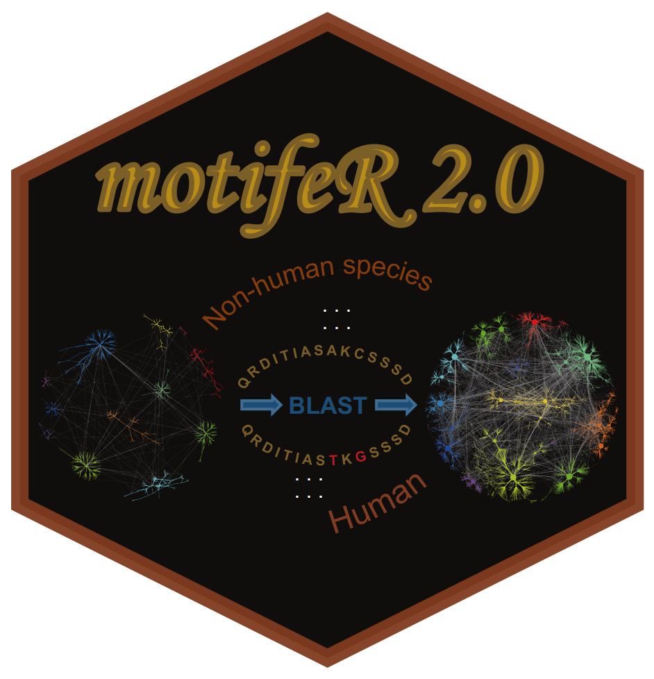
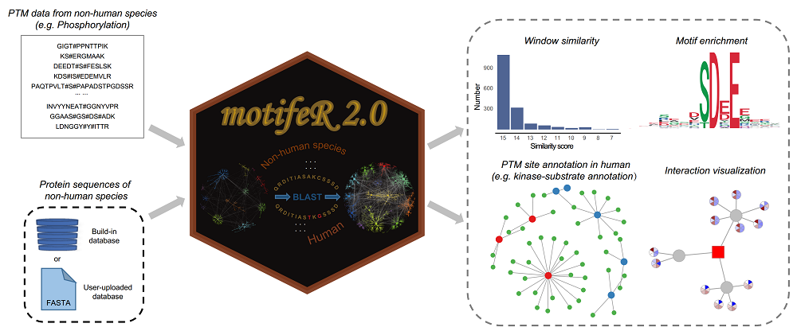
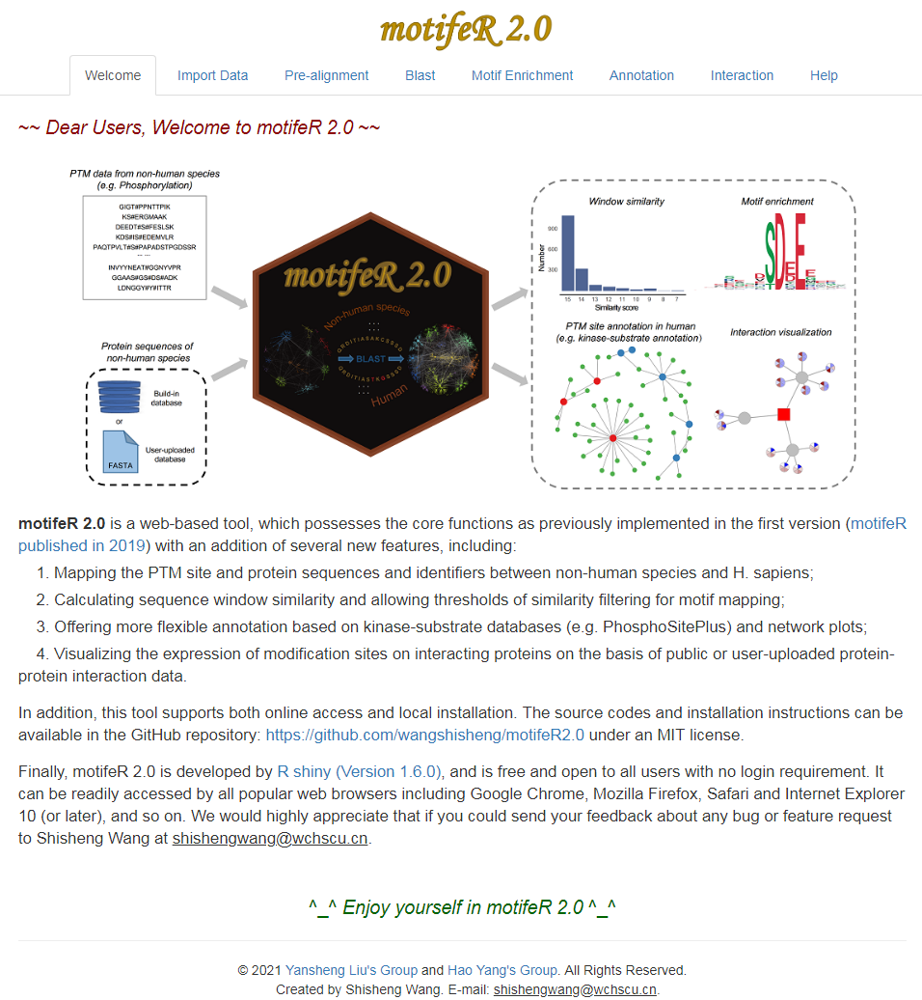

# motifeR 2.0
motifeR 2.0: improving analysis and annotation of protein post-translational modification motifs

## Brief Description
**<font size='5'> motifeR 2.0</font>** is a web-based tool, which possesses the core functions as previously implemented in the first version [motifeR published in 2019](https://doi.org/10.1002/pmic.201900245) with an addition of several new features, including:1. Mapping the PTM site and protein sequences and identifiers between non-human species and H. sapiens; 2. Calculating sequence window similarity and allowing thresholds of similarity filtering for motif mapping; 3. Offering more flexible annotation based on kinase-substrate databases (e.g. PhosphoSitePlus) and network plots; 4. Visualizing the expression of modification sites on interacting proteins on the basis of public or user-uploaded protein-protein interaction data. This software is available here: [https://yslproteomics.shinyapps.io/motifeR2](https://yslproteomics.shinyapps.io/motifeR2).

## Graphical Abstract


## How to use
A detailed introduction of this software can be found in the **Help** part of this tool: [https://yslproteomics.shinyapps.io/motifeR2](https://yslproteomics.shinyapps.io/motifeR2). And if you want to install this software locally, please check below.

## Run it locally
This tool is developed with R, so if you want to run it locally, you may do some preparatory work:  
**1. Install R.** You can download R from here: [https://www.r-project.org/](https://www.r-project.org/).  
**2. Install RStudio.** (Recommendatory but not necessary). You can download RStudio from here: [https://www.rstudio.com/](https://www.rstudio.com/).  
**3. Check packages.** After installing R and RStudio, you should check whether you have installed these packages (devtools,shiny,shinyBS,shinyjs,shinyWidgets,DT,gdata,knitr,ggplot2,ggsci,openxlsx,data.table,Biostrings,stringi,stringr,ggrepel,igraph,ggraph,graphlayouts,scales,scatterpie,plotfunctions,mapplots,impute,tidyr,msa). You may run the codes below to check them:  

```r
if(!require(pacman)) install.packages("pacman")
pacman::p_load(devtools,shiny,shinyBS,shinyjs,shinyWidgets,DT,gdata,knitr,ggplot2,ggsci,openxlsx,data.table,Biostrings,stringi,stringr,ggrepel,igraph,ggraph,graphlayouts,scales,scatterpie,plotfunctions,mapplots,impute,tidyr,msa)
```

**4. Install packages locally.** motifeR needs two more packages ([rmotifx](https://github.com/omarwagih/rmotifx) and [ggseqlogo](https://github.com/omarwagih/ggseqlogo)), however, the functions in the two packages are not enough. I update some functions, and you should download and then install them locally.

rmotifx: download from here: [https://github.com/wangshisheng/motifeR/blob/master/rmotifx_1.0.tar.gz](https://github.com/wangshisheng/motifeR/blob/master/rmotifx_1.0.tar.gz).  
ggseqlogo: download from here: [https://github.com/wangshisheng/motifeR/blob/master/ggseqlogo_0.1.tar.gz](https://github.com/wangshisheng/motifeR/blob/master/ggseqlogo_0.1.tar.gz).

After downloading them, set the path where the packages are:
```r
setwd('path') #path is where the two packages are.
install.packages("rmotifx_1.0.tar.gz", repos = NULL,type="source")
install.packages("ggseqlogo_0.1.tar.gz", repos = NULL,type="source")
```

If the preparatory work has been done, you can run this tool locally as below:
```r
if(!require(motifeR2)) devtools::install_github("wangshisheng/motifeR2.0")
library(motifeR2)
motifeR2_app()
```
Then motifeR will be started as below:


## Friendly suggestion
1. Open motifeR 2.0 with Chrome, Mozilla Firefox, Safari or Firefox.
2. The minimum operating system specifications are: **RAM 4GB, Hard drive 100 GB.**


## Contact
You could push an issue on this github. And optionally, please feel free to sent me an e-mail if you have any question or find a bug about this tool. Thank you^_^
Email: shishengwang@wchscu.cn.


